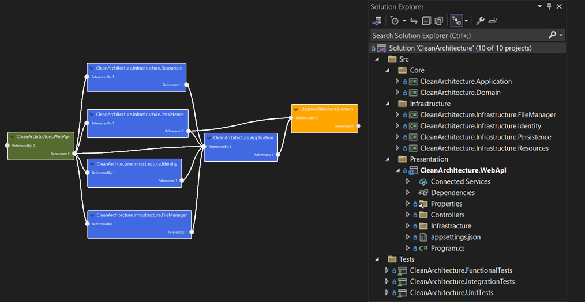

# Blazor Advanced With Multiple Types of Development Once & Apply to All types 
Here Development is all only once but can be used in any type with any level of easy expansion with ReUsable & Shared Components with Advanced Security of data & api.
Example Provided MyTown usecase,like that anyne can replace or extend easily upto any level.

- Type1: Blazor WebAssembly Stnadalone(PWA+Offline) Client(Static App) & ASP Dotnet Core Clean Architecture Api
  (For less cost consumption due to Static WebApp Deployment )

- Type2: Blazor WebAssembly Stnadalone(PWA+Offline) Client Hosted on ASP Dotnet Core Clean Architecture Api Single Project Deployment
  (For Advanced with Easy Deployment Just like Api deployment specifically in advanced case)

- Type3:(Adding Sooner) Blazor WebApp With Auto Render Modes
  (For Advanced Sensitive cases)

# Lets Jump Into Interesting Architectural Design 
- Api & Backend


- Blazor WebAssembly CLient & ReUsable components


- Together Shared Project structure as below,


- Detailed Diagram


- Request Anonymous, Authentication Flow


Forked & inspired from many other Good projects Globally, I additionally adding improvements with Blazor Standalone Webassembly client & making completely disconnected architecture implementation with features,

>Social accounts login & Jwt

>Same Jwt token using for validation with API calls with id_Tokens & validation

>For new users dynamically creates AspNet Identity Account & more

>Razor Class Library & Component based reusable architecture in multi-layered projects

>Fluxor Redux Pattern

>IExceptionHandler implemetnation of dotnet 8

>IP Rate limiting on API to secure attacks

>Only API Side configuration & dynamically load those to client webassembly without hardcoded client Appsettings for security concern

>CLient side only api url first time ,reamining all fetching from API dynamically

>Offline Db with Blazored.localstorage

>More necessary features will be adding sooner like  Auto refresh...
Authentication & made Apis only responded to dedicated cleints using AppKey & Interceptors logic, will share the details soon but code & fully working code is in place.


# Big Thanks to The most decent API code Author ### Saman Azadi (https://github.com/samanazadi1996)
  On Top Of Base Branch more contents adding here for improvement

# For db migration or update migration follow below steps,
0> make changes in domains
1> Set API project as startup project(must be only one startup project,if api & client both startup then it creates issue )
2> then specific commands like any of below
  - add-migration baseEntityChanges -Context ApplicationDbContext -project CleanArchitecture.Infrastructure.Persistence
    - update-database -Context ApplicationDbContext
  - add-migration baseEntityChanges -Context FileManagerDbContext -project CleanArchitecture.Infrastructure.FileManager
    - update-database -Context FileManagerDbContext
  - add-migration baseEntityChanges -Context IdentityContext -project CleanArchitecture.Infrastructure.Identity
    - update-database -Context IdentityContext


Below is mostly forked contents with default of ONLY API focused:

An Implementation of Clean Architecture with ASP.NET Core 8 WebApi. With this Open-Source BoilerPlate Template, you will get access to the world of Loosely-Coupled and Inverted-Dependency Architecture in ASP.NET Core 8 WebApi with a lot of best practices.

# Getting Started with Dotnet cli

The following prerequisites are required to build and run the solution:

- [.NET 8.0 SDK](https://dotnet.microsoft.com/download/dotnet/8.0) (latest version)

The easiest way to get started is to install the [.NET template](https://www.nuget.org/packages/Sam.CleanArchitecture.Template):
```
dotnet new install Sam.CleanArchitecture.Template
```

You should see the template in the list of templates from dotnet new list after this installs successfully. Look for "ASP.NET Clean Architecture Solution" with Short Name of "ca-api".

Navigate to the parent directory in which you'd like the solution's folder to be created.

Run this command to create the CleanArchitecture project
##### "-n MyProjectName" can be our desired name for the project

``` sh
dotnet new ca-api -n MyProjectName
```

The MyProjectName directory and solution file will be created, and inside that will be all of your new solution contents, properly namespaced and ready to run/test!

### To increase the speed of coding, you can use the commands added in this package
1. [Create new UseCase](./Documents/CleanArchitectureTemplates.md#create-new-usecase)
1. [Create New Entity](./Documents/CleanArchitectureTemplates.md#create-new-entity)
1. [Create New Resource](./Documents/CleanArchitectureTemplates.md#create-new-resource)
1. [Easy Add Migration Tools ](./Documents/EasyAddMigrationTools.md)

# Getting Started with Visual Studio

[Download the Extension](https://marketplace.visualstudio.com/items?itemName=SamanAzadi1996.ASPDotnetCoreCleanArchitecture) and install it on your machine. Make sure Visual Studio 2022 is installed on your machine with the latest SDK.

Follow these Steps to get started.

[](#)

You Solution Template is Ready with default as below!

[](#)

Next, open the appsettings.json file in WebAPI to modify the ConnectionStrings if necessary.

Finally, build and run the Application.

# Default Roles & Credentials

As soon you build and run your application, default users and roles get added to the database.

Default Roles are as follows.
- Admin

Here are the credentials for the default users.
- UserName - Admin / Password - Sam@12345


You can use these default credentials to generate valid JWTokens at the ../api/v1/Account/Authenticate endpoint.

[](#)

# Purpose of this Project
Does it really make sense to Setup your ASP.NET Core Solution everytime you start a new WebApi Project ? Aren't we wasting quite a lot of time in doing this over and over gain?

This is the exact Problem that I intend to solve with this Full-Fledged ASP.NET Core 8 WebApi Solution Template, that also follows various principles of Clean Architecture.

The primary goal is to create a Full-Fledged implementation, that is well documented along with the steps taken to build this Solution from Scratch. This Solution Template will also be available within Visual Studio 2022 (by installing the required Nuget Package / Extension).

Demonstrate Clean Monolith Architecture in ASP.NET Core 8
- This is not a Proof of Concept
- Implementation that is ready for Production
- Integrate the most essential libraries and packages

# Give a Star ⭐️

If you found this Implementation helpful or used it in your Projects, do give it a star. Thanks!

# Technologies

- ASP.NET Core 8 WebApi
- REST Standards
- Blazor Standalone WebAssembly Client
- Fluxor/Redux
- Serilog
- Rate limiting
- Social Account login & Jwt validation of API also
- MudBlazor

# Features

- [Clean Architecture](./Documents/CleanArchitecture.md)
- CQRS with MediatR Library
- Entity Framework Core - Code First
- [Repository Pattern - Generic](./Documents/RepositoryPatternGeneric.md)
- Serilog
- Swagger UI
- [Response Wrappers](./Documents/ResponseWrappers.md)
- [Healthchecks](./Documents/Healthchecks.md)
- Pagination
- Microsoft Identity with JWT Authentication
- Role based Authorization
- [Identity Seeding](./Documents/IdentitySeeding.md)
- [Database Seeding](./Documents/DatabaseSeeding.md)
- [Custom Exception Handling Middlewares](./Documents/ExceptionHandlingMiddlewares.md)
- API Versioning
- [Localization (fa / en)](./Documents/Localization.md)
- Fluent Validation
- Complete User Management Module (Register / Authenticate / Change UserName / Change Password)
- [User Auditing](./Documents/UserAuditing.md)
- TestProjects
    - [FunctionalTests](./Documents/FunctionalTests.md)
    - [UnitTests](./Documents/UnitTests.md)

# Prerequisites

- Visual Studio 2022 Community and above
- .NET Core 8 SDK and above
- Basic Understanding of Architectures and Clean Code Principles
- Blazor Knowledge

# Share it!

I have personally not come across any existing clean implementation of ReUsable & Extendable Blazor options with WebAPI, which is the reason that I started building this up. There are quite a lot of improvements and fixes along the way from the day I started out. Thanks to the community for the support and suggestions. Please share this Repository within your developer community, if you think that this would a difference! Thanks.

# Questions

If any issue or Questions Please raise!!!


